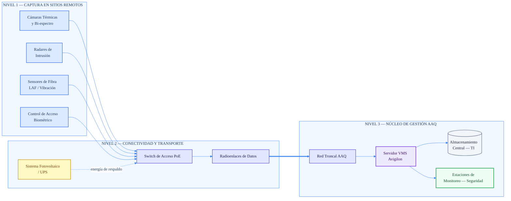
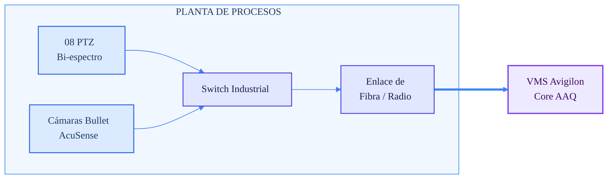
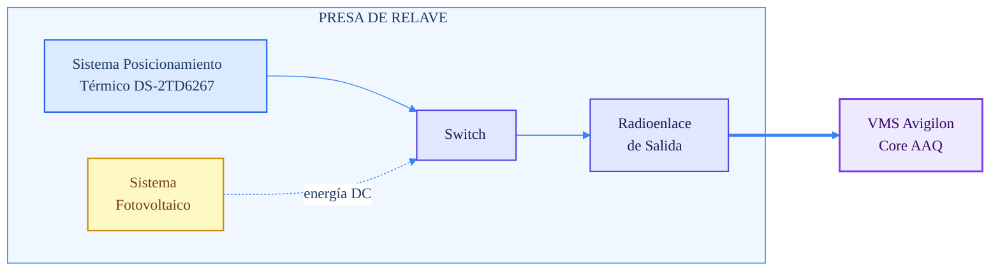
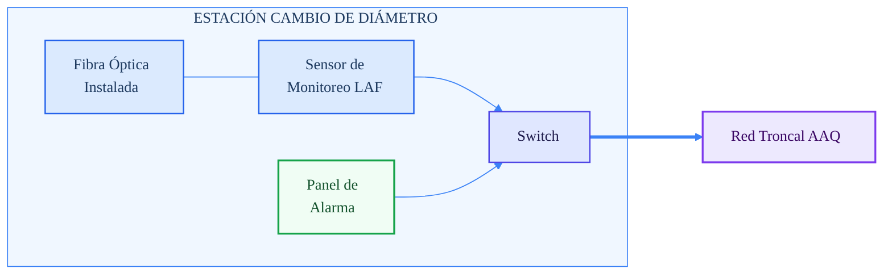
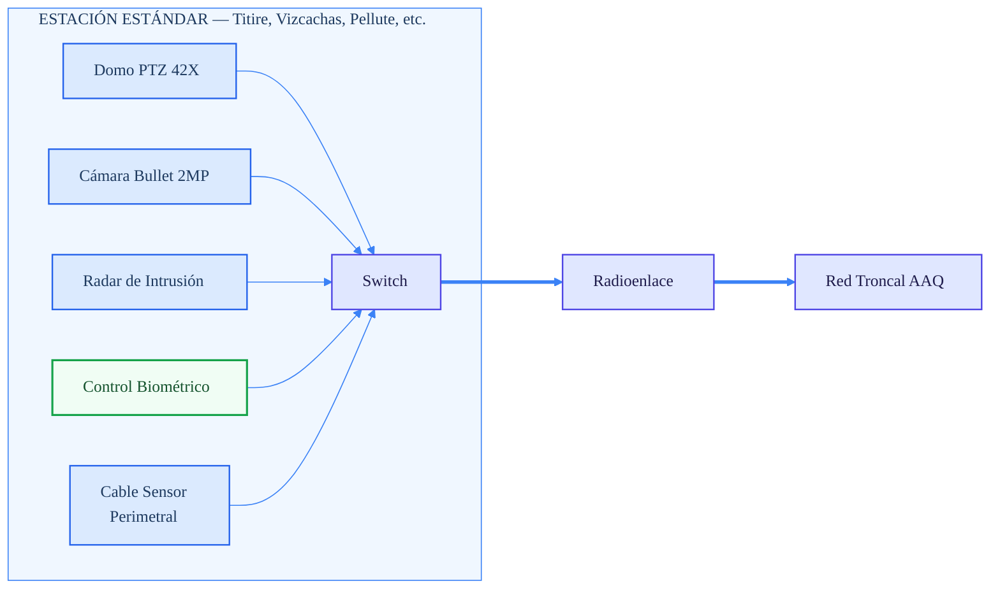

# Arquitectura de Solución de Seguridad

Este repositorio documenta la arquitectura de una solución de seguridad física y monitoreo remoto orientada a sitios industriales, integrando captura en campo, transporte de datos, núcleo de gestión y operación centralizada.

La solución contempla:

- Sensores y dispositivos de campo.
- Infraestructura de conectividad y energía.
- Núcleo de gestión sobre AAQ Core.
- Monitoreo y operación centralizada.
- Casos de despliegue por tipo de sitio.

---

## Contenido

- [Arquitectura general](#arquitectura-general)
- [Sitios específicos](#sitios-específicos)
  - [Planta de Procesos](#sitio-planta-de-procesos)
  - [Presa de Relave](#sitio-presa-de-relave)
  - [Estación Cambio de Diámetro](#sitio-estación-cambio-de-diámetro)
  - [Estación Estándar](#sitio-estación-estándar-titire-vizcachas-pellute-etc)
- [Convención visual](#convención-visual)
- [Uso en presentaciones](#uso-en-presentaciones)

---

## Arquitectura general

---

## Sitios específicos

### Sitio: Planta de Procesos

**Caso de uso:** alta densidad de video para vigilancia operacional y seguridad perimetral.

---

### Sitio: Presa de Relave

**Caso de uso:** vigilancia de largo alcance con soporte energético autónomo.

---

### Sitio: Estación Cambio de Diámetro

**Caso de uso:** monitoreo de fibra LAF y correlación con alarmas de campo.

---

### Sitio: Estación Estándar (Titire, Vizcachas, Pellute, etc.)

**Caso de uso:** vigilancia perimetral estándar con video, radar, control de acceso y sensor de cable perimetral.

---

## Convención visual

La documentación usa una convención de color unificada para facilitar lectura técnica y consistencia visual:

| Clase | Color base | Uso |
|---|---|---|
| `sensor` | Azul claro | Cámaras, sensores, fibra, cable perimetral |
| `network` | Índigo claro | Switches, enlaces, red troncal |
| `power` | Amarillo claro | Energía, solar, UPS |
| `core` | Violeta claro | VMS, Core AAQ |
| `storage` | Gris claro | Almacenamiento |
| `ops` | Verde claro | Operación, alarmas, control de acceso |

---

## Uso en presentaciones

Estos diagramas pueden usarse de tres maneras:

1. Directamente en GitHub como bloques `mermaid`.
2. Exportándolos a **SVG** o **PNG** para insertarlos en PowerPoint.
3. Manteniendo el código fuente en el repositorio y una versión gráfica para propuestas comerciales.

Para exportarlos como imagen, una ruta práctica es usar Mermaid Live Editor y descargar en SVG o PNG.

---

## Notas

- Si alguna variante visual no se renderiza igual en GitHub, conviene exportar el diagrama como SVG e insertarlo como imagen en la presentación.
- Si quieres mantener edición simple, deja el código Mermaid en el repositorio y usa el SVG solo para la presentación final.
